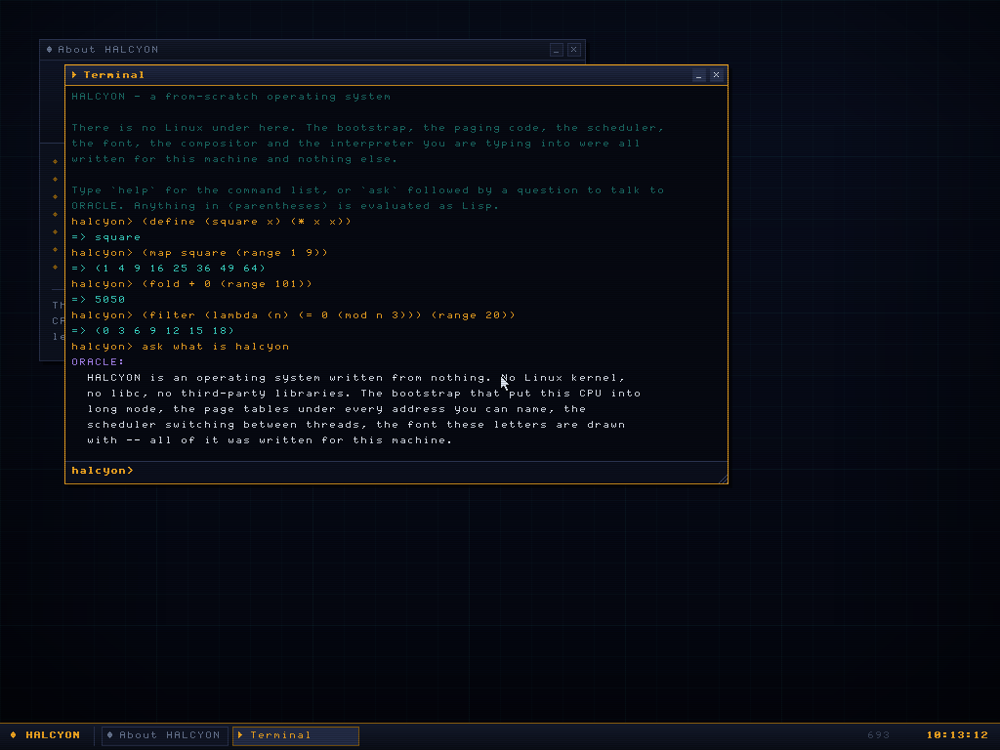
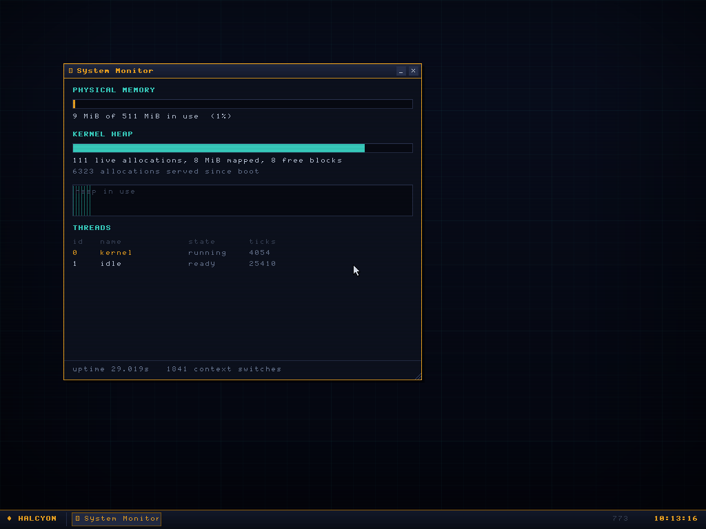
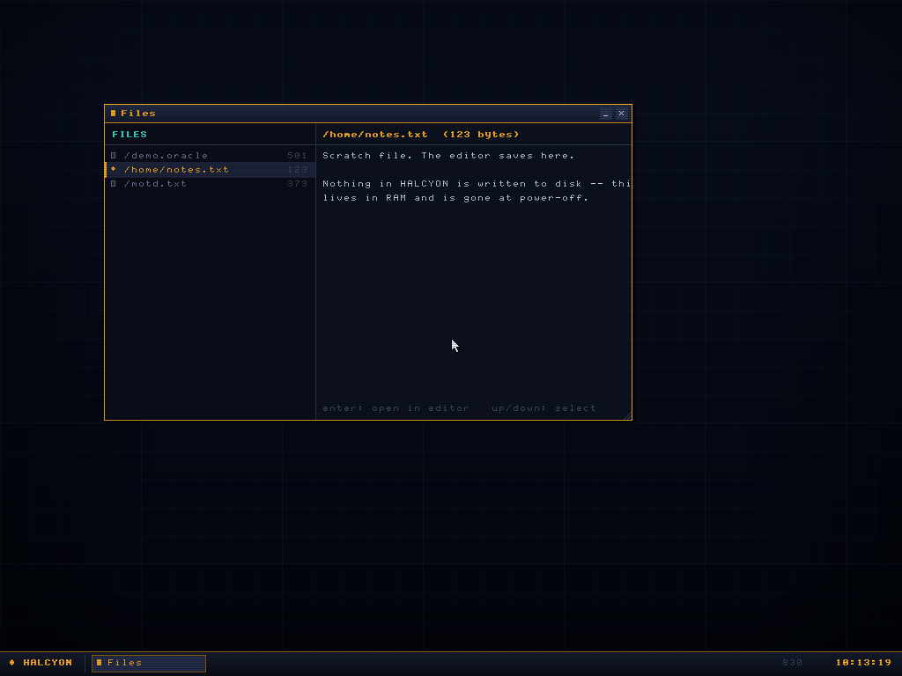
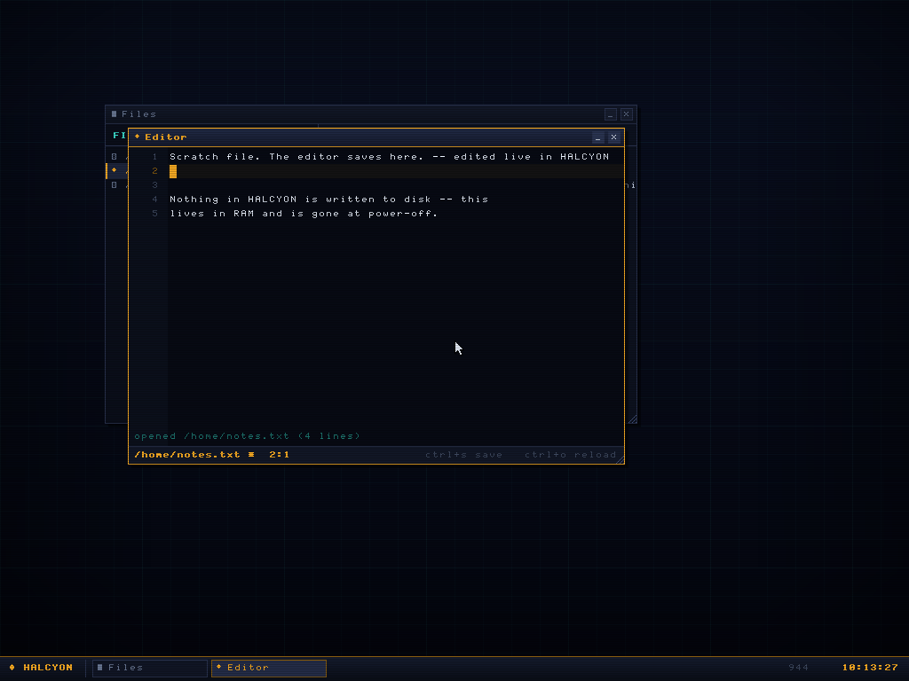
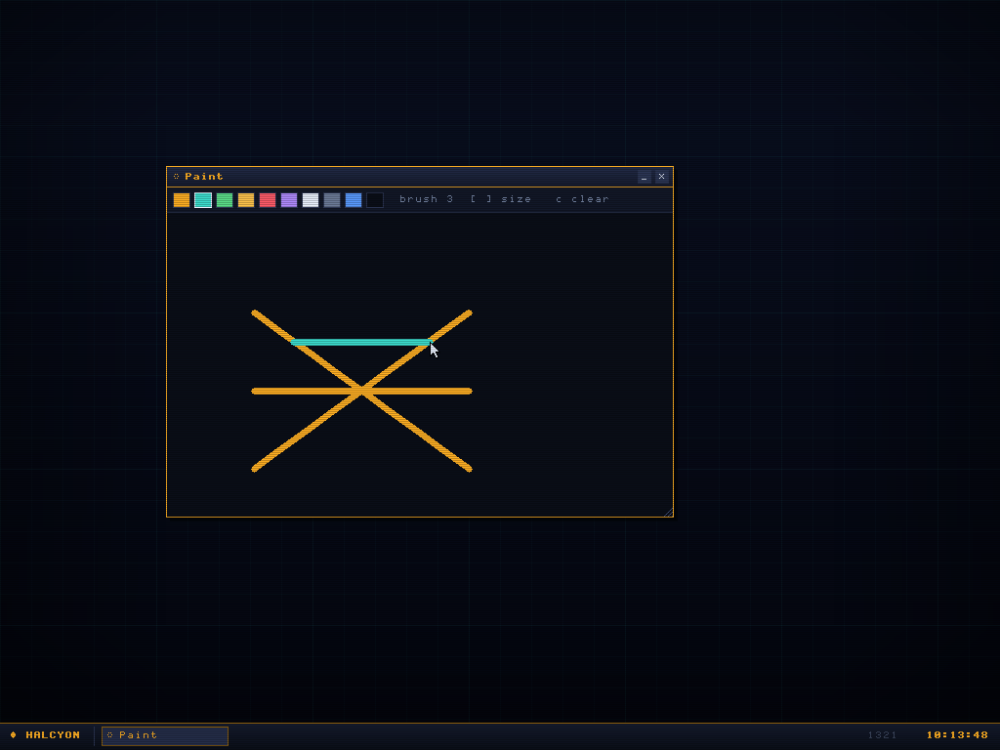
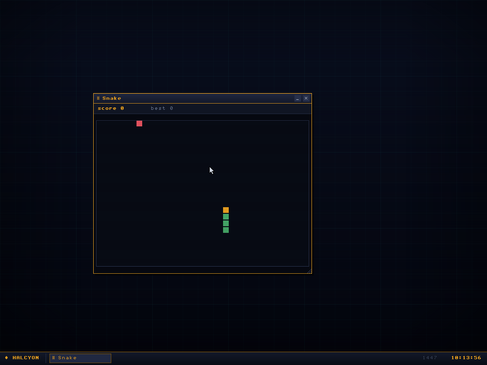
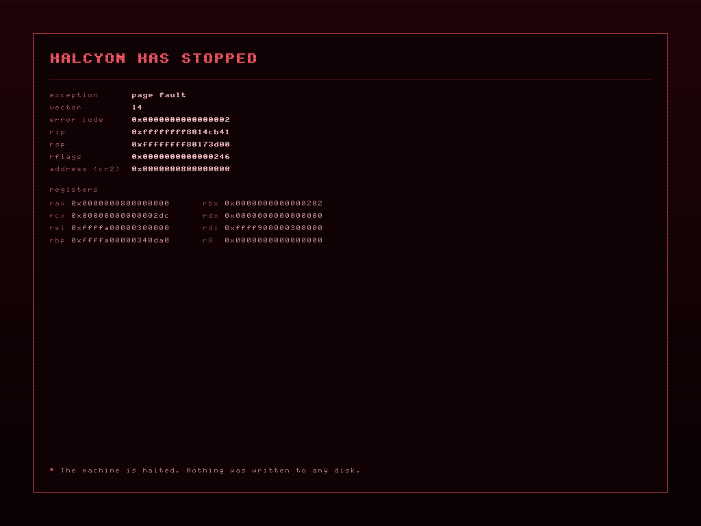
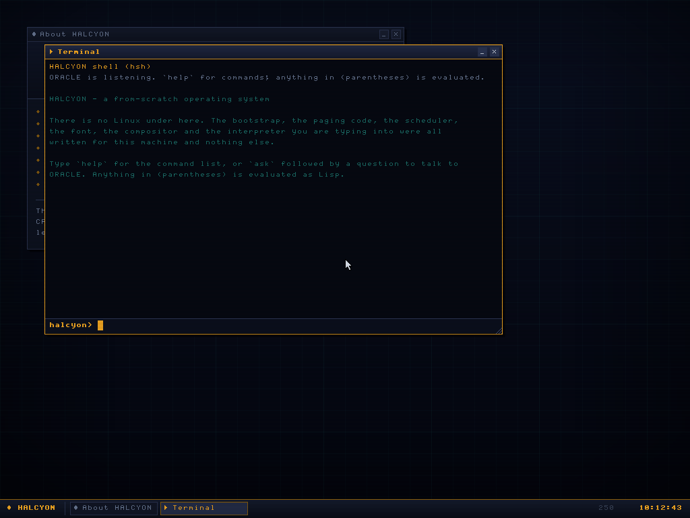

<div align="center">

# HALCYON

**A from-scratch x86_64 operating system.**

No Linux. No libc. No third-party crates. The bootstrap that puts the CPU into
long mode, the page tables under every address, the scheduler, the font, the
compositor and the Lisp interpreter were all written for this machine.

Boots on legacy BIOS and 64-bit UEFI, from a USB stick or a VM.
Runs entirely in RAM and never writes to a disk.


</div>

---

## What it actually is

A hobby OS that boots to a graphical desktop with a real shell. Roughly 9,000
lines of Rust, built on the stable toolchain — no nightly, no `build-std`, no
custom target JSON.

- **Kernel**: Multiboot2 bootstrap → long mode → higher half at
  `0xFFFFFFFF80000000`. GDT with a TSS and interrupt stack tables, all 256 IDT
  vectors, the 8259 PIC, a 1 kHz PIT.
- **Memory**: bitmap frame allocator, 4-level paging with per-section
  permissions, a direct map of physical RAM, and an address-sorted coalescing
  heap backing Rust's `alloc`.
- **Threads**: pre-emptive round-robin kernel threads, plus an idle thread that
  halts the CPU when there is nothing to do.
- **Graphics**: a double-buffered compositor, a font drawn for this system, and
  a CRT pass that darkens alternate scanlines.
- **Shell**: `hsh`, with **ORACLE** — a small Lisp with working tail calls —
  as its interpreter.

`ORACLE` also answers questions in English, from a hand-written table. It is not
a language model; there is no model on this machine and no network stack to
reach one, and it will tell you so if you ask.

## Get it running

### Getting the ISO

Every CI run builds and boot-tests one, then attaches it: open the latest green
run under [Actions](../../actions), and download the **halcyon-iso** artifact
(it arrives as a zip containing `halcyon.iso` and its SHA-256).

To get a permanent download link instead, tag a commit and push it — the
workflow publishes the ISO as a [Release](../../releases):

```sh
git tag -a v0.1.0 -m "HALCYON v0.1.0" && git push origin v0.1.0
```

Then either:

```sh
# a virtual machine
qemu-system-x86_64 -m 512M -cdrom halcyon.iso

# or a USB stick — check the device name twice
sudo dd if=halcyon.iso of=/dev/sdX bs=4M status=progress conv=fsync
```

On Windows use [Rufus](https://rufus.ie) in DD mode, or drop the ISO onto a
[Ventoy](https://ventoy.net) stick. For VirtualBox or VMware, make a 64-bit
"Other" guest with 512 MB of RAM and attach the ISO — no virtual disk needed.

### Booting your own machine

**It cannot damage anything.** There is no block-device write path anywhere in
the source tree — not disabled, not gated behind a flag, simply absent. HALCYON
reads the firmware's memory map, draws on the screen and talks to the keyboard.
That is the extent of its reach.

The one real compatibility risk is input: HALCYON uses the 8042 PS/2 controller
and has no USB stack, so a machine whose firmware drops USB legacy emulation
will boot to a desktop that ignores your typing. Laptop built-in keyboards are
nearly always fine. [docs/HARDWARE.md](docs/HARDWARE.md) covers the workarounds
and everything else that can go wrong.

### Building it yourself

Needs a Rust toolchain and a few packages:

```sh
sudo apt-get install qemu-system-x86 xorriso mtools \
    grub-pc-bin grub-efi-amd64-bin grub-common ovmf
rustup target add x86_64-unknown-none

make iso        # -> build/halcyon.iso
make run        # boot it under QEMU (BIOS)
make run-uefi   # boot it under QEMU (UEFI, via OVMF)
make smoke      # headless boot test, both firmwares
```

## Using it

The desktop opens with an About window and a terminal.

| | |
|---|---|
| **F1–F7** | terminal, monitor, files, editor, paint, snake, about |
| **alt+tab** | cycle windows |
| **ctrl+W** | close the focused window |
| drag the title bar | move a window; the corner grip resizes it |

In the terminal, `help` lists the commands and `lisp` the language. Anything in
parentheses is evaluated:

```lisp
halcyon> (define (square x) (* x x))
halcyon> (map square (range 1 9))
=> (1 4 9 16 25 36 49 64)
halcyon> (fold + 0 (range 101))
=> 5050
halcyon> ask what is halcyon
```

Tail calls work, which matters when your stack is 64 KiB:

```lisp
halcyon> (define (down n) (if (<= n 0) 'done (down (- n 1))))
halcyon> (down 200000)
=> done
```



## The rest of it

| | |
|---|---|
|  |  |
| **System monitor** — live physical memory, heap usage and its history, and the thread table. | **Files** — the RAM filesystem, seeded from the initrd, with a preview pane that hex-dumps binaries. |
|  |  |
| **Editor** — line numbers, a modified marker, ctrl+S to save back to RAM. | **Paint** — strokes interpolate between mouse samples, so fast movement leaves no gaps. |
|  |  |
| **Snake** — every operating system needs one. | **Faults** — when something breaks, HALCYON says what and where, then halts. Provoke it from the GRUB self-test entry. |

## Boot sequence

<div align="center">

</div>

## How it is tested

`tools/smoke.py` boots the ISO in QEMU with no display, asserts on markers in
the serial log, and drives the machine through the QEMU monitor — typing shell
commands, dragging windows by their title bars, playing Snake — capturing PNG
screenshots at each step. It exits non-zero if a marker is missing, a panic
appears, or the boot times out.

The kernel also checks itself at boot and reports on the boot screen:

- the heap runs ~4,400 allocations across `Vec`, `String`, `BTreeMap` and
  over-aligned blocks, then verifies the free list coalesced back with nothing
  outstanding;
- three threads that never yield are timed to confirm the scheduler really is
  pre-empting them rather than letting them take turns;
- the IDT asserts its stub table is exactly the size its addressing assumes.

CI runs all of it on both firmwares, plus the fault handler and a scripted
desktop session, on every push.

## Reading the source

```
kernel/src/
  boot/      multiboot2 header, the 32-bit → long mode stub, tag parsing
  arch/      GDT/TSS, IDT, interrupt dispatch, PIC, PIT, CPUID, ACPI, ports
  mm/        frame allocator, paging, kernel heap
  task/      pre-emptive threads and the scheduler
  drivers/   PS/2 keyboard and mouse, serial, RTC, PCI, PC speaker
  gfx/       framebuffer, surfaces, the font, the CRT pass
  ui/        compositor, window manager, theme, cursor
  fs/        tar initrd reader and the RAM filesystem
  oracle/    the Lisp: reader, evaluator, builtins, persona
  apps/      terminal, monitor, files, editor, paint, snake, about
tools/       mkfont.py (the font), smoke.py (the test harness), mkinitrd.sh
```

| document | what it covers |
|---|---|
| [ARCHITECTURE.md](docs/ARCHITECTURE.md) | a tour from the first instruction to the desktop |
| [MEMORY-MAP.md](docs/MEMORY-MAP.md) | the address space, and why it is laid out that way |
| [ORACLE.md](docs/ORACLE.md) | the language and the persona |
| [FONT.md](docs/FONT.md) | how the glyphs were drawn |
| [HARDWARE.md](docs/HARDWARE.md) | running it on a real machine, and what can go wrong |
| [ADDING-AN-APP.md](docs/ADDING-AN-APP.md) | write a window in about sixty lines |

## What it deliberately does not have

No disk writes, no network stack, no USB, no user mode, no SMP. Each of those is
a real project on its own, and leaving them out is what kept this one small
enough to read.

## Licence

MIT. See [LICENSE](LICENSE).

The font is drawn in `tools/mkfont.py` and carries no third-party licence, which
is precisely why it was drawn rather than borrowed.
